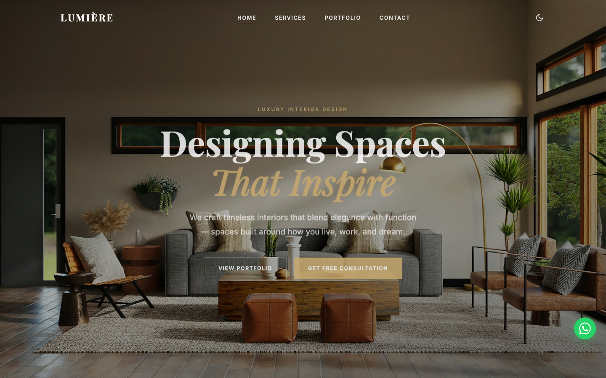

# LUMIÈRE — Luxury Interior Design

A polished, single-page static site for a luxury interior design studio. Built with vanilla HTML, CSS, and JavaScript — no frameworks, no build step.

## Overview

LUMIÈRE showcases a curated portfolio of residential and commercial interior spaces, paired with service offerings, client testimonials, and a contact form. The site is fully responsive and supports light/dark mode with user preference persistence.

## Features

**Dark / Light Mode** — CSS custom properties drive the entire colour system. The user's choice is stored in `localStorage` and applied on every visit without flash.

**Portfolio Filter** — Projects are tagged by room type (living room, bedroom, office, kitchen). Filter buttons instantly show or hide matching cards with no page reload.

**Lightbox** — Clicking any portfolio card opens a full-resolution overlay with the project title.

**Testimonial Carousel** — Client quotes rotate automatically every 5.5 seconds and pause on hover.

**Scroll Animations** — An `IntersectionObserver` triggers fade-in transitions as content enters the viewport.

**Contact Form** — Validated client-side on blur and submit, then posted via `fetch()` to FormSubmit. No backend required.

## Tech Stack

- **Markup / Styling / Logic**: HTML5, CSS3, Vanilla JavaScript (ES2020)
- **Fonts**: Google Fonts — Playfair Display & Inter
- **Images**: Unsplash (CDN, no local assets)
- **Form Delivery**: FormSubmit (no-server email relay)
- **Hosting**: GitHub Pages

## Live Demo

[kepgithub24.github.io/Interior-Design](https://kepgithub24.github.io/Interior-Design/)

## Getting Started

No install needed. Clone the repo and open `index.html` in a browser:

```bash
git clone https://github.com/Kepgithub24/Interior-Design.git
cd Interior-Design
open index.html
```

## Screenshot



## License

All Rights Reserved © LUMIÈRE
